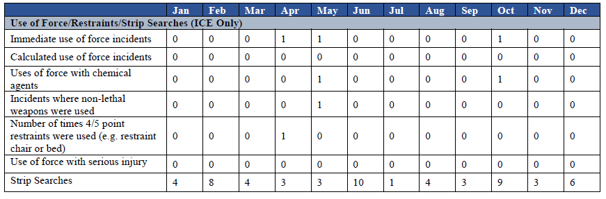

```{r include=FALSE, cache=FALSE}
rm(list = ls(all = TRUE))
```

# Introduction

```{r setup, include=FALSE}
knitr::opts_chunk$set(echo = FALSE)
options(scipen=999)

library(tidyverse)
library(kableExtra)
library(ggplot2)

source("scripts/load_data_all.R")
load("data/data.RData")
```

```{r, echo= FALSE, out.width= "60%", out.extra='style="float:right; padding:10px"'}
knitr::include_graphics('./images/inspection_cover_page.jpg')
```

This project involves collating, cleaning, performing preliminary analysis of, and supplying to the public inspections related data released by Immigration and Customs Enforcement (ICE). ICE oversees a sprawling network of more than 200 immigration detention facilities. The agency is required to inspect each of these facilities at least annually according to one of several sets of detention standards. In 2018, Congressional appropriations stipulated that "ICE is directed to make public all final detention facility inspection reports within 60 days of inspection" [@departme2017, 33]. As of July, 2021 ICE is not complying with this standing directive from Congress (see \@ref(note-regarding-inspections)). Our aim was to assemble this information together in one place, process and provide the data using reproducible methods [@yu2020; @implemen2014], and offer some insights regarding what we found.

## What We Found

This portion of the project looks at all ICE detention facility inspections that use the most current Significant Incident Summary (SIS) form. These are all inspections between `r format(inspect_earliest, format= "%B %e, %Y")` and `r format(inspect_latest, format= "%B %e, %Y")`. This sample entails `r inspect_proc_n` SIS forms at `r facility_n` facilities. Within this sample of `r inspect_proc_n` inspections, `r pass_perc`% (n=`r pass`) received a rating of either "Meets Standards" or "Acceptable."

The ICE G-324A Significant Incident Summary is organized around the following categories of information: Assaults, Disciplinary, Solitary, Use of Force, Sexual Abuse and Assault, Medical, Cause of Death.

### Assaults

-   There were `r assault_sum` assaults
-   The five facilities with the most number of assaults were: Krome Service Processing Center (n=470), Adelanto ICE Processing Center West (n=390), Prairieland Detention Center (n=330), South Texas ICE Processing Center (n=312), and Adelanto ICE Processing Center East (n=264)

### Disciplinary

-   Facilities logged `r disciplinary_sum` disciplinary infractions, of these `r disciplinary_guilty_perc`% (n=`r disciplinary_guilty_sum`) were found guilty.
-   Of the disciplinary infractions `r disciplinary_appeal` were appealed and `r disciplinary_in_favor_detained_sum` were found in favor of the detained person.
-   `r disciplinary_60_days` individuals experienced disciplinary sanctions over 60 days; this indicates prolonged solitary.
-   The five facilities with the most number of disciplinary entries were: Eloy Detention Center (n=7128), La Palma (n=6954), Krome Service Processing Center (n=4888), Sherburne County Jail (n=4070), and Immigration Centers of America - Farmville (n=3808).

### Solitary

-   There were `r segregation_sum` recorded instances of solitary confinement.
-   Administrative solitary comprised, `r segregation_admin_perc`% (n=`r segregation_admin_sum`) of the cases.
-   Disciplinary solitary made up `r segregation_disciplinary_perc`% (n=`r segregation_disciplinary_sum`) of the cases.
-   Solitary confinement for mental health reasons made up `r segregation_mental_health_perc`% (n=`r segregation_mental_health_sum`) of the cases.

### Use of Force

-   There were `r use_force_sum` use of force incidents.
-   Strip searches constituted `r use_force_strip_search_perc`% (n=`r use_force_strip_search_sum`) of the use of force incidents.
-   There were `r use_force_chemical_agents_sum` use of force incidents involving chemical agents, making up `r use_force_chemical_agents_perc` of the use of force incidents.
-   There is reason to believe that use of force incidents are significantly under reported (Section \@ref(under-reporting-use-of-force-incidents)).

### Sexual Abuse and Assault

-   748 sexual abuse allegations, \>500 detained person on detained person, 189 staff or contractor on detained person

-   102 allegations substantiated, \>90 detained person on detained person, 6 staff or contractor on detained persons

### Medical Observation

-   \>25,000 individuals under medical observation, \>4500 for mental health
-   9666 instances of infectious diseases confirmed
-   \>56,000 outside medical referrals, \>9300 for emergency care, \>580 for mental health reasons
-   \>240 suicide attempts, \>5100 individuals placed on suicide watch.
-   \>1300 hunger strikes

## Note Regarding Inspections

In 2018, ICE established a "[Facilities Inspection](https://www.ice.gov/detain/facility-inspections)" web page and began releasing documents back to May of that year.[^index-1] The website states that "ICE is posting all facility inspection reports submitted by the third-party contractor. The reports are posted below in chronological order within 60 days of inspection." For each "inspection report" ICE supplies two documents:

[^index-1]: The look of the page was modified under the Biden administration but the contents are functionally identical to the page created under the Trump administration.

-   a G-324A form known as a Significant Incident Summary (SIS) and,
-   a cover letter by the inspections contractor The Nakamoto Group.[^index-2]

[^index-2]: The SIS form G-324 is generally 4-9 pages depending on the version. On the new longer forms, one page is always nearly completely redacted, and two pages are boilerplate definitions. Therefore, both forms contain fewer than 5 pages of information.

There are two major versions of the G324A form, one revised in 2007/2008 (Figure \@ref(fig:pre2019-sis)) and another revised in 2019 (Figure \@ref(fig:post2019-sis)). Both versions of the G-324A form state that "the following information [must be completed]{.ul} prior to the scheduled review dates" (underline in original) and that "[t]his form should be filled out by the facility prior to the start of any inspection."

```{r pre2019-sis, out.width = "100%", fig.cap="Pre-2019 Form G 324-A SIS showing instructions."}
knitr::include_graphics('images/atlantaCityDetentionCenter_SIS_06_21_2018.jpg')
```

```{r post2019-sis, out.width = "100%", fig.cap="Post-2019 Form G 324-A SIS showing instructions."}
knitr::include_graphics('images/MOROWOH21-MorrowCoCorrFac-SIS.jpg')
```

Congress directed ICE to release "all final detention facility reports." ICE claims to post "all facility inspection reports," but instead *ICE is posting SIS forms that must be filled out before inspectors even arrive at the facility*. Full facility inspection reports regularly run in excess of 150 pages. There are examples of complete inspections obtained by National Immigrant Justice Center ([NIJC](https://immigrantjustice.org/research-items/report-lives-peril-how-ineffective-inspections-make-ice-complicit-detention-center)) through FOIA [@nijc2015]. Outside of those earlier FOIA requests, which required lengthy litigation by the NIJC to force compliance, ICE has released no full inspection reports and is not complying with an unambiguous Congressional mandate to do so.

Though not in compliance, the SIS and cover letter forms do provide some information to the public. Unfortunately, data are siloed in individual pdf documents and presented in tables that are not commensurate with comparative analysis. To make matters worse, as of February 2021, ICE under the Biden administration began releasing un OCR'd bit-mapped versions of the SIS forms. Previously, these forms were released as full text pdfs. The decision by ICE to do this to SIS forms makes it that much harder to use the data that are released.[^index-3] *This project seeks to retrieve data from these documents, clean and organize that information into a usable form, and supply it along with some preliminary analysis to the public.*

[^index-3]: Under ICE Acting Director Tae Johnson, DHS Secretary Alejandro Mayorkas, and ultimately President Joe Biden.

## How the work was done

During the Summer of 2021, data from the SIS and inspection cover letters was compiled into a series of spreadsheets, note this work is still in progress. Nathan Craig developed the idea for a project to collate and organize information in SIS and inspection cover letters to examine them for trends, patterns, and anomalies. The work was performed by three students funded under a National Science Foundation grant awarded to Dr. Neil Harvey (NMSU) and Dr. Jeremy Slack (NMSU). The students who performed the work were Juan Becerra (Stanford), Avigail Turima Romo (Columbia), and Daniela Navarro Verdugo (CSSLO). The three students worked with Dr. Craig to develop a workflow for compiling individual SIS and inspection cover letters into a series of spreadsheets. These web pages, still in development, document those procedures. Much of the analysis is done in R [@R-base], `tidyverse` [@R-tidyverse], and ggplot2 [@R-ggplot2].

```{r package-references-1}
knitr::write_bib(file = 'packages.bib')
```
```{r include=FALSE, cache=FALSE}
rm(list = ls(all = TRUE))
```

<!--chapter:end:index.Rmd-->

```{r include=FALSE, cache=FALSE}
rm(list = ls(all = TRUE))
```
# Inspection Standards and Ratings

```{r}
knitr::opts_chunk$set(
	echo = FALSE,
	message = FALSE,
	warning = FALSE
)
options(scipen=999)
```

```{r}
library(tidyverse)
library(kableExtra)

load("data/data.RData")
```

All adult facility inspections listed on the ICE website were inspected by The Nakamoto Group. There are two major sets of standards and several versions of each. These are the Performance Based National Detention Standards (PBNDS) for dedicated facilities and the National Detention Standards for non-dedicated facilities. PBNDS has two versions: PBNDS 2008 and PBNDS 2011 with revisions in 2016. NDS also has two versions: NDS 2000 and NDS 2019. Though ICE detention is not punitive, both sets of standards are based on corrections models [@schriro2009, 2-3]. Except for Service Processing Centers managed by ICE, all facilities are managed by either private prison companies, sheriff's offices, or a local corrections board.

> "ICE relies primarily on correctional incarceration standards designed for pre-trial felons and on correctional principles of care, custody, and control. These standards impose more restrictions and carry more costs than are necessary to effectively manage the majority of the detained population" [@schriro2009, 2-3].

## Standards Applied

Between `r format(inspect_earliest, format= "%B %e, %Y")` and `r format(inspect_latest, format= "%B %e, %Y")`, `r inspect_proc_n` facilities were inspected. Of these, `r pbnds_perc`% (n=`r pbnds`) were inspected under some version of PBNDS and `r nds_perc`% (n=`r nds`) were inspected under some version of NDS (Table \@ref(tab:summary-standards)).

```{r summary-standards}
df_standards %>% 
 
  kable(caption = "Summary of inspections by type of standard.",
        col.names = c("Rating", "Count", "%")) %>% 
  kable_styling(c("hover", "striped", "condensed", "responsive"))
```

## Inspections by Facility and Operator

Among the `r inspect_proc_n` facilities in the sample, most facilities were inspected one or two times Table \@ref(tab:inspection-facility-count). During the span of time represented by this sample, three is the maximum number of times a facility was inspected. These facilities are represented by: Dorchester County Detention Center, Golden State Annex, and River Correctional Center.

```{r inspection-facility-count}
# df_facility_n_inspect <- df_324 %>% 
#   group_by(facility, fac_operator) %>% 
#   summarise(n_inspections = n()) %>% 
#   ungroup() 
  
df_facility_n_inspect %>% 
  kable(caption = "Number of inspections per facility in sample.",
        col.names = c("Facility", "Facility Operator", "Inspections Reviewed")) %>% 
  kable_styling(c("hover", "striped", "condensed", "responsive")) %>% 
  scroll_box(height = "300px")
```

```{r}
# private_operators <- c("CoreCivic", "The GEO Group, Inc.", "LaSalle Corrections", "Management & Training Corporation (MTC)")
# 
# df_324 %>% 
#   select(facility, fac_operator) %>% distinct(facility, .keep_all = TRUE) %>% 
#   filter(fac_operator %in% private_operators)
```

Among the `r inspect_proc_n` inspections in the sample, 46% (n=58) were at facilities operated by four private prison companies: The GEO Group, CoreCivic, LaSalle Corrections, and MTC (Table \@ref(tab:inspection-operator-count)). Tallying inspections by operator, 39% (n=49) are operated by a combination of county sheriff's offices or state corrections boards. ICE operated facilities represent 7% (n=9) of the inspections.

```{r inspection-operator-count}
df_324 %>% 
  select(facility, fac_operator) %>% 
  group_by(fac_operator) %>% 
  summarise(operator_count = length(fac_operator)) %>% 
  arrange(desc(operator_count)) %>% 
    kable(caption = "Inspections by facility operator.",
        col.names = c("Facility Operator", "Inspection Count")) %>% 
  kable_styling(c("hover", "striped", "condensed", "responsive")) %>% 
  scroll_box(height = "300px")
```

## Recommended Rating

Among the `r inspect_proc_n` inspections reviewed, `r pass_perc`% (n=`r pass`) received a rating of either "Meets Standards" or "Acceptable" while `r no_pass_perc`% (n=`r no_pass`) were recommended "Does Not Meet Standards" or "Deficient" (Table \@ref(tab:summary-recommended-rating)).

```{r summary-recommended-rating}

df_rating %>% 
  kable(caption = "Facility inspection recommended rating.",
        col.names = c("Rating", "Count", "%")) %>% 
  kable_styling(c("hover", "striped", "condensed", "responsive"))
```

Three of the five facilities that did not pass inspection are managed by county sheriff's offices, one is a county managed detention center. Notably, the fifth non-passing facility is Krome, a dedicated ICE Service Processing Center. It bears mention that Krome was the first service processing center established in 1980 under the Immigration and Naturalization Service, and since its founding is a facility riddled with problems [@simon1998.; @lindskoog2018; @loyd2018; @lipman2013; @helton1986; @helton1986a]. However, as will become apparent, there are deep and significant problems with facilities that passed inspection.

```{r}
df_324 %>% 
  filter(recommended_rating %in% c("Does Not Meet Standards", "Deficient")) %>% 
  select(facility, fac_operator, inspection_date, standards, recommended_rating) %>% 
  kable(caption = "Facilities that did not pass inspection.",
        col.names = c("Facility", "Facility Operator", "Inspection Date", "Standards", "Recommended Rating")) %>% 
  kable_styling(c("hover", "striped", "condensed", "responsive"))
```
```{r include=FALSE, cache=FALSE}
rm(list = ls(all = TRUE))
```

<!--chapter:end:Ch-Recommended-Rating.Rmd-->

```{r include=FALSE, cache=FALSE}
rm(list = ls(all = TRUE))
```
# Assaults

```{r setup-4, include=FALSE}
knitr::opts_chunk$set(
	echo = FALSE,
	message = FALSE,
	warning = FALSE
)
options(scipen=999)
```

```{r load-libraries-4, message=FALSE}
library(tidyverse)
# Plotting
library(ggplot2)
library(gghighlight)
library(RColorBrewer)

# Tables
library(kableExtra)

load("data/data.RData")
```

The ICE G-324A Significant Incident Summary sheet contains information on a number of different kinds of assaults. Specifically, there are four categories of assaults listed:

-   Detained Person on Staff with Serious Injury
-   Detained Person on Staff without Serious Injury
-   Detained Person on Detained Person with Serious Injury
-   Detained Person on Detained Person without Serious Injury

Conspicuously absent from this list of assault types are assaults on detained persons by staff. This is deeply concerning because already initial review of inspection forms and prior news stories indicates that staff assaults on detained persons do occur. However, these are described as "use of force" incidents and are not tallied as assaults. Use of force incidents are described in Section \@ref(use-of-force).

Out of the `r inspect_proc_n` inspections that occurred at `r facility_n` facilities between `r format(inspect_earliest, format= "%B %e, %Y")` and `r format(inspect_latest, format= "%B %e, %Y")`, there were `r assault_sum` assaults (Table \@ref(tab:assault-summary-by-type)).

Over the course of 20.5 months represented by the inspections in this sample, there were on average `r round(assault_sum/20.5, digits=0)` assaults per month.The majority of those assaults occurred between detained persons and did not result in serious injury (86%, n=2926). The SIS form does distinguish if an assault on a person detained by ICE was by another person detained by ICE or by a person detained under a corrections context. This is an important detail because many facilities are mixed use wherein individuals detained for civil immigration purposes are in corrections facilities.

```{r assault-summary-by-type}
df_assaults %>% 
  group_by(assault_type) %>% 
  summarise(`Total Assaults by Type` = sum(assault_count, na.rm = TRUE)) %>% 
  ungroup() %>% 
  kable(caption = "Total Assaults by Type",
        col.names = c("Assault Type", "Total Assault Type")) %>% 
  kable_styling(c("hover", "striped", "condensed", "responsive"))
```

```{r df-assaults-sum}
df_assaults_sum <- df_assaults %>% 
  group_by(facility) %>% 
  summarise(total_assaults = sum(assault_count, na.rm = TRUE)) %>% 
  arrange(desc(total_assaults)) %>% 
  ungroup()
  
df_assaults_sum <- left_join(df_assaults_sum, df_facility_n_inspect) %>% 
  mutate(total_assaults_by_inspection = round(total_assaults / n_inspections, digits = 0))


m_assaults_fac_by_insp <- mean(df_assaults_sum$total_assaults_by_inspection)
sd_assaults_fac_by_insp <- sd(df_assaults_sum$total_assaults_by_inspection)
outlier_assault_fac_by_insp <- m_assaults_fac_by_insp+(2*sd_assaults_fac_by_insp)
```

The mean number of assaults by facility per inspection is `r round(m_assaults_fac_by_insp, digits=0)` (SD=`r round(sd_assaults_fac_by_insp, digits=2)`) (Table \@ref(tab:assault-summary-by-facility)). Based on this mean, five facilities have greater than average number of assaults per inspection (\> `r round(outlier_assault_fac_by_insp, digits=2)` assaults) (Figures \@ref(fig:histogram-assaults-by-inspection) and \@ref(fig:assault-greater-than-average-facility)). Among the facilities with significantly higher than average number of assaults per inspection three are managed by The Geo Group; one is managed by LaSalle Corrections; and one is a Service Processing Center managed by ICE.

```{r assault-summary-by-facility}
color.me <- which(df_assaults_sum$total_assaults_by_inspection > outlier_assault_fac_by_insp)

df_assaults_sum %>% 
  select(-n_inspections) %>%
  relocate(fac_operator, .after = facility) %>% 
  kable(caption = "Assaults by facility, facilities with significantly greater than average number of assaults by inspection shown in bold.",
        col.names = c("Facility", "Facility Operator", "Total Assaults", "Assaults by Inspections")) %>%
  kable_styling(c("hover", "striped", "condensed", "responsive")) %>% 
  row_spec(color.me, bold = TRUE) %>%
  scroll_box(height = "300px")
```

```{r histogram-assaults-by-inspection, fig.cap="Histogram of assaults by inspection highlighting facilities that have significantly higher than average number of assaults per inspection."}
df_assaults_sum %>% 
  ggplot(aes(x = total_assaults_by_inspection, fill= facility))+
  geom_histogram()+
  gghighlight(max(total_assaults_by_inspection) > outlier_assault_fac_by_insp, use_direct_label = FALSE)+
  labs(title = "Histogram of assaults by inspection",
       subtitle = "Facilities with significantly higher than average number of assaults per inspection highlighted.",
       fill = "Facility")+
  xlab("Assaults by Inspection")+
  ylab("Number of Facilities")

```

```{r assault-greater-than-average-facility, fig.cap="Facilities in the sample with greater than average number of assaults per inspection."}
df_assaults_sum %>% 
  filter(total_assaults_by_inspection > outlier_assault_fac_by_insp) %>% 
  ggplot(aes(x = total_assaults_by_inspection, y=reorder(facility, -total_assaults_by_inspection, sum)))+
  geom_bar(stat="identity")+

  xlab("Assaults by Inspection")+
  ylab("Facility")
```

## Facet Plot of Assaults by Facility

The figure below is a facet plot of the assault categories present on the G-324A SIS form.

```{r assault-facet, fig.height=40}

# Generating a linetype vector for use in the plot
plot_lines <- c(
    "solid",
    "solid",
    "solid",
    "solid",
    "dotted"
    )

# Use Color Brewer to set colors and modify
# the last color to be black for totals.
plot_colors <- brewer.pal(5, "Paired")
plot_colors[5] <- "#000000"

# Create the labels
plot_labels <- c(
    "Detained Person on Staff w. Serious Injury",
    "Detained Person on Staff w/o Serious Injury",
    "Detained Person on Detained Person w. Serous Injury",
    "Detained Person on Detained Person w/o Serous Injury",
    "Total Assaults")

df_assaults %>% 
  # Calling the plot and formatting
  ggplot(aes(x=date, y = assault_count, linetype=assault_type))+
  geom_line(aes(color = assault_type), size =.65) +
  
  # Set the line type
  scale_linetype_manual(
    values = plot_lines,
    labels = plot_labels,
    name = "Assault Type:",
    guide = guide_legend(nrow = 5)
    )+
  
  # Setting the color
  scale_color_manual(
    values = plot_colors,
    labels = plot_labels,
  name = "Assault Type:"
  )+

  labs(title = "Reported Assaults")+
  ylab("Number of Assaults")+
  xlab("Date")+
  theme(
    strip.text = element_text(size = 8),
    legend.position = "bottom"
    )+

  # Set the legend to multiple rows
  guides(col = guide_legend(nrow =5))+
  
  # Wrap
  facet_wrap(~ facility, ncol=3)
```
```{r include=FALSE, cache=FALSE}
rm(list = ls(all = TRUE))
```

<!--chapter:end:Ch-324A-2019-Assaults.Rmd-->

```{r include=FALSE, cache=FALSE}
rm(list = ls(all = TRUE))
```
# Disciplinary

```{r setup-5, include=FALSE}
knitr::opts_chunk$set(echo = FALSE)
options(scipen=999)
```

```{r load-libraries-5, message=FALSE}
# Plotting
library(ggplot2)
library(RColorBrewer)

# Tables
library(kableExtra)

load("data/data.RData")
```

```{r}
df_discipline_sum <- df_discipline %>% 
  group_by(facility) %>% 
  filter(disciplinary_type == "total_disciplinary") %>% 
  summarise(total_disciplinary_facility = sum(disciplinary_count, na.rm = TRUE)) %>% 
  arrange(desc(total_disciplinary_facility)) %>% 
  ungroup

df_discipline_sum <- left_join(df_discipline_sum, df_facility_n_inspect) %>% 
  mutate(total_disciplinary_by_inspection = round(total_disciplinary_facility / n_inspections, digits = 0)) %>% 
  relocate(fac_operator:n_inspections, .after= facility)

m_discipline_fac_by_insp <- mean(df_discipline_sum$total_disciplinary_by_inspection)
sd_discipline_fac_by_insp <- sd(df_discipline_sum$total_disciplinary_by_inspection)
outlier_discipline_fac_by_insp <- m_discipline_fac_by_insp + 2*sd_discipline_fac_by_insp
```

As a matter of law, ICE detention is not punitive it is purely administrative civil holding to ensure that individuals are present for their immigration proceedings (REFF). Despite that fact, there is a tremendous amount of punitive disciplinary actions that occur in ICE detention facilities. Some of this information on discipline in ICE detention is logged in facility inspections.

During the `r inspect_sample_interval` covering the period between `r format(inspect_earliest, format= "%B %e, %Y")` and `r format(inspect_latest, format= "%B %e, %Y")`, there were `r disciplinary_sum` disciplinary infractions issued by facility operators (Table \@ref(tab:total-disciplinary-type)). There were an average of `r round(m_discipline_fac_by_insp, digits = 2)` (SD = `r round(sd_discipline_fac_by_insp, digits = 2)`) disciplinary infractions per facility by inspection (Table \@ref(tab:disciplinary-by-facility)).

Four facilities have significantly greater than average number of disciplinary infractions per inspection (Figures \@ref(fig:histogram-disciplinary-by-inspection) and \@ref(fig:disciplinary-greater-than-average-facility)). Of the facilities with greater than average number of disciplinary infractions issued per inspection two are managed by CoreCivic, one is managed by Immigration Centers of America, and one is managed by ICE.

```{r total-disciplinary-type}
df_discipline %>% 
  group_by(disciplinary_type) %>% 
  summarise(`Total Disciplinary by Type` = sum(disciplinary_count, na.rm = TRUE)) %>% 
  ungroup() %>% 
  kable(caption = "Total Disciplinary by Type",
        col.names = c("Discipline Type", "Total Discipline Type")) %>% 
  kable_styling(c("hover", "striped", "condensed", "responsive"))
```

```{r disciplinary-by-facility}
color.me <- which(df_discipline_sum$total_disciplinary_by_inspection > outlier_discipline_fac_by_insp)

df_discipline_sum %>% 
  group_by(facility) %>% 
  # summarise(total_disciplinary = sum(disciplinary_count, na.rm = TRUE)) %>% 
  arrange(desc(total_disciplinary_facility)) %>%
  select(-n_inspections) %>% 
  ungroup() %>% 
  kable(caption = "Total discipline by facility, with facilities having significnatly greater than average number of disciplinary infractions issued per inspection shown in bold.",
        col.names = c("Facility", "Facility Operator",  "Total Discipline by Facility", "Total Disciplinary by Inspection")) %>% 
  kable_styling(c("hover", "striped", "condensed", "responsive")) %>% 
  row_spec(color.me, bold = TRUE) %>% 
  scroll_box(height = "300px")
  
```

```{r histogram-disciplinary-by-inspection, fig.cap="Histogram of disciplinary infractions issued by inspection highlighting facilities that have significantly higher than average number of disciplinary infractions issued per inspection."}
df_discipline_sum %>% 
  ggplot(aes(x = total_disciplinary_by_inspection, fill = facility))+
  geom_histogram()+
  gghighlight(max(total_disciplinary_by_inspection) > outlier_discipline_fac_by_insp, use_direct_label = FALSE)+
  labs(title = "Histogram disciplinary infractions issued by inspection",
       subtitle = "Facilities with significantly higher than average number of disciplinary infractions per inspection highlighted.",
       fill = "Facility")+
  xlab("Disciplinary by Inspection")+
  ylab("Number of Facilities")
```

```{r disciplinary-greater-than-average-facility, fig.cap="Facilities in the sample with greater than average number of disciplinary infractions issued per inspection."}
df_discipline_sum %>% 
  filter(total_disciplinary_by_inspection > outlier_discipline_fac_by_insp) %>% 
  ggplot(aes(x = total_disciplinary_by_inspection, y=reorder(facility, -total_disciplinary_by_inspection, sum)))+
  geom_bar(stat="identity")+

  xlab("Disciplinary Infractions by Inspection")+
  ylab("Facility")
```

## Facet Plot of Disciplinary by Facility

```{r disciplinary-facet, fig.height=40}
# Generating a linetype vector for use in the plot
plot_lines <- c(
    "solid",
    "solid",
    "solid",
    "solid",
    "solid",
    "dotted"
    )

# Use Color Brewer to set colors and modify
# the last color to be black for totals.
plot_colors <- brewer.pal(6, "Paired")
plot_colors[6] <- "#000000"

# Create plot labels

plot_labels <- c(
    "Disciplinary Infractions",
    "Disciplinary Infractions - Guilty",
    "Disciplinary Appeals",
    "Disciplinary Appeals in Favor of Detainee",
    "Sanctions Over 60 Days",
    "Total Disciplinary")


df_discipline %>% 
  
  # Calling the plot and formatting
  ggplot(aes(x=date,
             y = disciplinary_count,
             linetype = disciplinary_type))+
  geom_line(aes(color = disciplinary_type), size = .65) +
  
  # Set the linetype
  scale_linetype_manual(
    values = plot_lines,
    labels = plot_labels,
    name = "Disciplinary Type:",
    guide = guide_legend(nrow = 6)
    )+
  
  # Setting the color
  scale_color_manual(
  values = plot_colors,
  labels = plot_labels,
  name = "Disciplinary Type:"
  )+

  labs(title = "Disciplinary")+
  ylab("Number of Disciplinary Infractions")+
  xlab("Date")+
  theme(
    strip.text = element_text(size = 8),
    legend.position = "bottom"
    )+

  # Set the legend to multiple rows
  guides(col = guide_legend(nrow =6))+
  
  # Wrap
  facet_wrap(~ facility, ncol=3)
```
```{r include=FALSE, cache=FALSE}
rm(list = ls(all = TRUE))
```

<!--chapter:end:Ch-324A-2019-Disciplinary.Rmd-->

```{r include=FALSE, cache=FALSE}
rm(list = ls(all = TRUE))
```
# Solitary

```{r setup-6, include=FALSE}
knitr::opts_chunk$set(echo = FALSE)
options(scipen=999)
```


```{r load-libraries-6, message=FALSE}
# Plotting
library(ggplot2)
library(RColorBrewer)

# Tables
library(kableExtra)

load("data/data.RData")
```

## Summary Tables

Of the present 163 inspections reviewed so far, there are more than 34,000 instances of solitary. That is roughly 208 instances of solitary per inspection.

```{r solitary-summary}
df_solitary %>% 
  group_by(segregation_type) %>% 
  summarise(`Total Solitary by Type` = sum(segregation_count, na.rm = TRUE)) %>% 
  ungroup() %>% 
  kable(caption = "Total Solitary by Type",
        col.names = c("Solitary Type", "Total Solitary Type")) %>% 
  kable_styling(c("hover", "striped", "condensed", "responsive"))


df_solitary %>% 
  group_by(facility) %>% 
  summarise(total_segregation = sum(segregation_count, na.rm = TRUE)) %>% 
  arrange(desc(total_segregation)) %>% 
  ungroup() %>% 
  kable(caption = "Total Solitary by Facility",
        col.names = c("Facility", "Total Solitary by Facility")) %>% 
  kable_styling(c("hover", "striped", "condensed", "responsive")) %>% 
  scroll_box(height = "300px")
```

## Facet Plots of Solitary by Facility

```{r solitary-facet, fig.height=40}
# Generating a linetype vector for use in the plot
plot_lines <- c(
    "solid",
    "solid",
    "solid",
    "solid",
    "dotted"
    )

# Use Color Brewer to set colors and modify
# the last color to be black for totals.
plot_colors <- brewer.pal(5, "Paired")
plot_colors[5] <- "#000000"

# Create plot labels
plot_labels <- c(
    "Administrative",
    "Disciplinary",
    "Medical",
    "Mental Health",
    "Total")

df_solitary %>% 

# Calling the plot and formatting
  ggplot(aes(x=date,
             y = segregation_count,
             linetype = segregation_type))+
  geom_line(aes(color = segregation_type), size = .65) +
  
  # Set the color
  scale_color_manual(
  values = plot_colors,
  name = "Solitary Type:",
  labels = plot_labels)+
  
  # Set the linetype
  scale_linetype_manual(
    values = plot_lines,
      name = "Solitary Type:",
    labels = plot_labels)+
  
  
  labs(title = "Reported Use of Solitary")+
  ylab("Number of Individuals Palced in Solitary")+
  xlab("Date")+
  theme(
    strip.text = element_text(size = 8),
    legend.position = "bottom"
    )+
    facet_wrap(~ facility, ncol=3)
```

## Solitary Over 60 Days

```{r solitary-60-facet}

# Use Color Brewer to set colors and modify
# the last color to be black for totals.
plot_colors <- brewer.pal(5, "Paired")
plot_colors[5] <- "#000000"

# Call the dataframe and select cols
df_324 %>% 
  select(id,
         facility,
         state,
         date,
         fac_operator,
         admin_seg_60_ice,
         disc_seg_60_ice) %>% 
  drop_na() %>% 
  
  # Need the rowwise function to compute a row-at-a-time
  # in the following mutate function
  rowwise(id) %>% 
  
  # Generate total col
  mutate(total_seg_60 = sum(c_across(
       admin_seg_60_ice:
       disc_seg_60_ice
  ), na.rm = TRUE)) %>%
  
  # Make tidy and filter
  pivot_longer(cols = admin_seg_60_ice:disc_seg_60_ice,
               names_to = "segregation_60_type",
               values_to = "segregation_60_count") %>%
  filter(segregation_60_type %in% c("admin_seg_60_ice", "disc_seg_60_ice")&
           segregation_60_count > 0) %>%
  
  # Initiate the plot and sort by sum
  ggplot(aes(x = segregation_60_count,
             y=reorder(fac_operator, segregation_60_count, sum),
             fill=segregation_60_type))+
  geom_bar(stat = "identity")+
  
  # Set the color fill
  scale_fill_brewer(type = "qual",
                    palette = "Paired",
                    name = "Segregation > 60 Type",
                    labels = c("Administrative",
                               "Disciplinary"))+
  labs(title= "Segregation > 60 Days by Facility Operator",
        x = "Segregation > 60 Days Count",
        y = "Facility Operator")+
  theme(legend.position = "bottom")
```


```{r include=FALSE, cache=FALSE}
rm(list = ls(all = TRUE))
```

<!--chapter:end:Ch-324A-2019-Solitary.Rmd-->

```{r include=FALSE, cache=FALSE}
rm(list = ls(all = TRUE))
```
# Use of Force

```{r setup-7, include=FALSE}
knitr::opts_chunk$set(
	echo = FALSE,
	message = FALSE,
	warning = FALSE
)
options(scipen=999)
```

```{r load-libraries-7, message=FALSE}
# Plotting
library(ggplot2)
library(RColorBrewer)

# Tables
library(kableExtra)

load("data/data.RData")
```

## Summary Tables

```{r use-of-force-annual-table}
df_force %>%
  mutate(inspection = str_c(facility, " - ", inspection_date), .before = facility) %>%
  filter(., use_of_force_type == "total_use_of_force") %>% 
  group_by(inspection) %>%
  summarise(total = sum(use_of_force_count)) %>% 
   
  select(inspection, total) %>% 
  arrange(desc(total)) %>% 

  kable(caption = "Total Use of Force Per Inspection by Facility",
        col.names = c("Inspection", "Total Use of Force")) %>% 
  kable_styling(c("hover", "striped", "condensed", "responsive")) %>% 
  scroll_box(height = "300px")
```

```{r use-of-force-no-ss-annual-table}
df_force %>%
  mutate(inspection = str_c(facility, " - ",
                            inspection_date)) %>%
  filter(!use_of_force_type %in% c("total_use_of_force", "strip_searches")) %>% 
  group_by(inspection) %>%
  summarise(total = sum(use_of_force_count)) %>% 
   
  select(inspection, total) %>% 
  arrange(desc(total)) %>% 

  kable(caption = "Use of Force Excluding Strip Searches Per Inspection by Facility",
        col.names = c("Inspection", "Use of Force Excluding Strip Searches")) %>% 
  kable_styling(c("hover", "striped", "condensed", "responsive")) %>% 
  scroll_box(height = "300px")
```

```{r use-force-annual-bar, fig.height=6, fig.cap="Facilities with >20 total Use of Force incidents by annual inspection"}
df_force %>% 
  mutate(id = as.numeric(id)) %>% 
  filter(., use_of_force_type == "total_use_of_force") %>% 
  group_by(id, facility, inspection_date) %>%
  summarise(total = sum(use_of_force_count)) %>% 
  mutate(inspection = str_c(facility, " - ", inspection_date), .after = id) %>% 
  select(inspection, facility, total) %>% 
  filter(total>20) %>% 
  ggplot(aes(x = total, y = reorder(facility, -total, sum)))+
  geom_bar(stat = "identity")+
  labs(title = "Inspections where > 20 Use of Force Incidents\nWere Reported for the Year.")+
  xlab("Use of Force Incidents Reported for Year")+
  ylab("Facility")

```

## Under Reporting Use of Force Incidents {#under-reporting-use-of-force-incidents}

There are few opportunities for independent evaluation of use of force incidents in ICE detention facilities. However, in at least some circumstances use of force incidents are inaccurately documented and under reported. For example, in some instances strip searches are tallied in total use of force summaries and in other cases they are not.

The Bristol County Jail is one noteworthy instance where use of force incidents received independent evaluation. On May 2, 2020 Massachusetts news outlets reported on a major incident that occurred at the Bristol County House of Correction the previous day when detained persons expressed concern about the potential for COVID-19 infection from the facility's medical wing [@dooling2020]. The Bristol County Sheriff claimed that people refused to go to the medical unit for testing, and those detained reported being attacked with pepper spray and dogs. Nakamoto Group Inspectors visited the facility between November 16-18, 2020 and reviewed it under PBNDS 2008 [@ice2020]. The inspectors received a G-324 SIS which reported use of force incidents (Figure \@ref(fig:bristol-2020-sis)). For May, the sheet lists 1 Immediate Use of Force Incident, 1 Use of Force with Chemical Agents, 1 Incident where Non-Lethal Weapons were Used, and 3 Strip Searches. The sheet lists no Use of Force with Serious Injury. Nakamoto Group inspectors found that the facility met all 39 standards and had only three deficient components: Key and Lock Control, Special Management Unit, and Suicide Prevention and Intervention. The Nakamoto inspection letter made no mention of use of force incidents.

```{r bristol-2020-sis, out.width = "100%", fig.cap="Cropped from Bristol County Jail SIS Form G-324 [@ice2020, 4]."}

```

The Massachusetts Attorney General's Office (MA AG) independently investigated the major incident that occurred on May 1, 2020 [@maag2020a]. The MA AG's factual findings [@maag2020a, 24-41] identifies:

-   2 instances involving immediate use of force;
-   1 immediate use of force incident with a chemical agent;
-   1 calculated use of force incident that involved 16 officers armed with pepper spray, flash bang grenades, riot shields, shotguns with bean bag rounds, pepper ball launchers, battering rams, multiple K9 teams; and another 12 person restraint team.

The Calculated Use of Force Incident unfolded over the course of more than an hour and involved the deployment of flash bang grenades; firing more than 30 rounds of pepper balls, several of which directly hit individuals; numerous instances involving K-9 use of force, and multiple "hands on" use of force instances. Additionally, the MA GA found multiple cases where individuals suffered serious injuries as the result of the use of force:

-   1 individual experienced cardiac arrest
-   1 individual with a history of chronic obstructive pulmonary disease (COPD) suffered respiratory distress
-   1 individual experienced respiratory distress resulting in critically low oxygen levels

The MA GA concluded that "a series of institutional failures and poor decisions" culminated in a "planned and deliberate--use of force against the ICE B detainees that was disproportionate to the security needs at that time and unnecessarily caused, or risked causing, harm to all involved"[@maag2020a, ii]. The MA GA found that facility staff used "a flash bang grenade, pepper-ball launchers, pepper spray canisters, anti-riot shields, and canines---against detainees who had exhibited calm and nonviolent behavior for at least an hour before this operation"[@maag2020a, ii].

The details of the May 1, 2020 Use of Force incident do not come to light in either SIS form or the Nakamoto Group inspection cover letter. The SIS form inaccurately characterizes the multiple Use of Force incidents entailed in the event, fails to report what is clearly a Calculated Use of Force, and does not report multiple Use of Force Incidents with Serious Injury that resulted from from the extensive use of pepper spray. The Nakamoto cover letter states that, "the detainees felt safe in the facility and registered no substantive com-plaints about any aspect of their detention except for their exposure to the COVID-19 risk in the facility." Inspectors wrote that "[t]here were no areas of concern or significant observations noted during the inspection" but noted that the "inspection was conducted remotely, and inspectors were unable to personally observe practices and procedures with-in the facility" and that the "inspection team relied upon photographs and/or videos to validate the observation of many standards."

## EXTRA TEXT TO INCCORPORATE

For example, at the Bristol County County Jail and House of Corrections independent investigation by the Massachusetts Office of Attorney General (MAOG) found that facility staff found a "planned and deliberate-use of force against the ICE detainees that was disproportionate to the security needs at that time and unnecessarily caused, or risked causing, harm to all involved" [@maag2020, ii]. The MOAG found that facility staff used "a flash bang grenade, pepper-ball launchers, pepper spray canisters, anti-riot shields, and canines--against detainees who had exhibited calm and nonviolent behavior for at least an hour before this operation" [@maag2020, ii]. Investigations found that staff "deployed these weapons both indiscriminately upon entry and also specifically against detainees who were not combative, assaultive, or otherwise actively resisting staff" [@maag2020, ii].

While the aforementioned Bristol County Jail may be a particularly egregious instance of staff assaulting detained persons, it is not an isolated case. For example, [video evidence](https://www.youtube.com/watch?v=JP_PfOhdLuM) from the Torrance County Detention Facility in Estancia NM shows CoreCivic's private facility staff pepper spraying persons detained by ICE on hunger strike [@swetlitz2020]. Review of inspections has also revealed additional inappropriate use of force incidents. The omission of a field to record instances of staff assaulting detained persons occludes and obscures real instances of violence. As the inspections process is a detention reform designed to make a more humane system of civil incarceration, the omission of categories for logging staff physical mistreatment of detained persons raises serious questions about the inspections processes ability to record significant and documented civil and human rights violations.

## Facet Plot of Use of Force by Facility

```{r use-force-facet, fig.height=40}
# Generating a linetype vector for use in the plot
plot_lines <- c(
    "solid",
    "solid",
    "solid",
    "solid",
    "solid",
    "solid",
    "solid",
    "dotted"
    )

# Use Color Brewer to set colors and modify
# the last color to be black for totals.
plot_colors <- brewer.pal(8, "Paired")
plot_colors[8] <- "#000000"

# Create plot labels
plot_labels <- c(
    "Immediate Use of Force Incidents",
    "Calculated Use of Force Incidents",
    "Uses of Force with Chemical Agents",
    "Incidents Where Non-Lethal Weapons Were Used",
    "Times 4/5 Point Restraints Used",
    "Use of Force With Serious Injury",
    "Strip Searches",
    "Total Disciplinary")

df_force %>% 
  
  # Calling the plot and formatting
  ggplot(aes(x=date, y = use_of_force_count, linetype=use_of_force_type))+
  geom_line(aes(color = use_of_force_type), size = .65) +
  
  # setting the linetype
  scale_linetype_manual(
    values = plot_lines,
    labels = plot_labels,
    name = "Use of Force Type:",
    guide = guide_legend(nrow = 8)
    )+
  
  # Setting the color
  scale_color_manual(
  values = plot_colors,
  labels = plot_labels,
  name = "Use of Force Type:",
  )+

  labs(title = "Disciplinary")+
  ylab("Number of Disciplinary Infractions")+
  xlab("Date")+
  theme(
    strip.text = element_text(size = 8),
    legend.position = "bottom"
    )+

    # Set the legend to multiple rows
  guides(col = guide_legend(nrow =8))+
  
  # Wrap
  facet_wrap(~ facility, ncol=3)
```
```{r include=FALSE, cache=FALSE}
rm(list = ls(all = TRUE))
```

<!--chapter:end:Ch-324A-2019-Use-of-Force.Rmd-->

```{r include=FALSE, cache=FALSE}
rm(list = ls(all = TRUE))
```
# Sexual Abuse and Assault

```{r setup-8, include=FALSE}
knitr::opts_chunk$set(
	echo = FALSE,
	message = FALSE,
	warning = FALSE
)
options(scipen=999)
```

```{r load-libraries-8, message=FALSE}
# Plotting
library(ggplot2)
library(RColorBrewer)

# Tables
library(kableExtra)

load("data/data.RData")
```

## Allegations

### Summary Tables

```{r sexual-abuse-allegation-summary}
df_sex_alleg %>% 
  group_by(sexual_abuse_allegations_type) %>% 
  summarise(`Sexual Abuse and Assault Allegations by Type` = sum(sexual_abuse_allegations_count, na.rm = TRUE)) %>% 
  ungroup() %>% 
  kable(caption = "Total Sexual Abuse and Assault Allegations by Type",
        col.names = c("Allegation Type", "Total Allegation Type")) %>% 
  kable_styling(c("hover", "striped", "condensed", "responsive"))


df_sex_alleg %>% 
  group_by(facility) %>% 
  summarise(total_sexual_abuse_allegations = sum(sexual_abuse_allegations_count, na.rm = TRUE)) %>% 
  arrange(desc(total_sexual_abuse_allegations)) %>% 
  ungroup() %>% 
  kable(caption = "Total Sexual Abuse and Assault Allegations by Facility",
        col.names = c("Facility", "Total Allegations by Facility")) %>% 
  kable_styling(c("hover", "striped", "condensed", "responsive")) %>% 
  scroll_box(height = "300px")
```

### Facet Plot of Sexual Abuse and Assault Allegations by Facility

```{r sexual-abuse-allegation-facet, fig.height=40}
# Generating a linetype vector for use in the plot
plot_lines <- c(
    "solid",
    "solid",
    "solid",
    "solid",
    "solid",
    "dotted"
    )

# Use Color Brewer to set colors and modify
# the last color to be black for totals.
plot_colors <- brewer.pal(6, "Paired")
plot_colors[6] <- "#000000"

# Create plot labels
plot_labels <- c(
    "Sexual Abuse Allegations - Detainee on Detainee",
    "Sexual Abuse Allegations - Inmate on Detainee",
    "Sexual Abuse Allegations - Detainee on Inmate",
    "Sexual Abuse Allegations - Staff/Contractor/Volunteer on Detainee",
    "Number of Sexual Abuse Allegations - Detainee on Staff/Contractor/Volunteer",
    "Total Sexual Abuse Allegations")

df_sex_alleg %>% 
  # Calling the plot and formatting
  ggplot(aes(x=date, y = sexual_abuse_allegations_count, linetype=sexual_abuse_allegations_type))+
  geom_line(aes(color = sexual_abuse_allegations_type),size=.65) +
  
  # Set the linetype
  scale_linetype_manual(
    values = plot_lines,
    labels = plot_labels,
    name = "Sexual Abuse Allegation Type:",
    guide = guide_legend(nrow = 6)
    )+
  
  # Set the color
  scale_color_manual(values = plot_colors,
                     labels = plot_labels,
                     name = "Sexual Abuse Allegation Type:")+

  labs(title = "Sexual Abuse Allegations")+
  ylab("Number of Allegations")+
  xlab("Date")+
  theme(
    strip.text = element_text(size = 8),
    legend.position = "bottom"
    )+

    # Set the legend to multiple rows
  guides(col = guide_legend(nrow =8))+
  
  # Wrap
  facet_wrap(~ facility, ncol=3)
```

## Substantiated Allegations

### Summary Tables

```{r sexual-abuse-substantiated-summary}
df_sex_alleg_sub %>% 
  group_by(sexual_abuse_substantiated_type) %>% 
  summarise(`Sexual Abuse and Assault Allegations Substantiated by Type` = sum(sexual_abuse_substantiated_count, na.rm = TRUE)) %>% 
  ungroup() %>% 
  kable(caption = "Total Substantiated Sexual Abuse and Assault Allegations by Type",
        col.names = c("Substantiated Allegation Type", "Total Substantiated Allegation Type")) %>% 
  kable_styling(c("hover", "striped", "condensed", "responsive"))


df_sex_alleg_sub %>% 
  group_by(facility) %>% 
  summarise(total_sexual_abuse_substantiated = sum(sexual_abuse_substantiated_count, na.rm = TRUE)) %>% 
  arrange(desc(total_sexual_abuse_substantiated)) %>% 
  ungroup() %>% 
  kable(caption = "Total Substantiated Sexual Abuse and Assault Allegations by Facility",
        col.names = c("Facility", "Total Substantiated Allegations by Facility")) %>% 
  kable_styling(c("hover", "striped", "condensed", "responsive")) %>% 
  scroll_box(height = "300px")
```

### Facet Plot of Substantiated Sexual Abuse and Assault Allegations

```{r sexual-abuse-substantiated-facet, fig.height=40}
# Generating a linetype vector for use in the plot
plot_lines <- c(
    "solid",
    "solid",
    "solid",
    "solid",
    "solid",
    "dotted"
    )

# Use Color Brewer to set colors and modify
# the last color to be black for totals.
plot_colors <- brewer.pal(6, "Paired")
plot_colors[6] <- "#000000"

# Create the labels
plot_labels <- c(
    "Sexual Abuse Allegations - Detainee on Detainee",
    "Sexual Abuse Allegations - Inmate on Detainee",
    "Sexual Abuse Allegations - Detainee on Inmate",
    "Sexual Abuse Allegations - Staff/Contractor/Volunteer on Detainee",
    "Number of Sexual Abuse Allegations - Detainee on Staff/Contractor/Volunteer",
    "Total Sexual Abuse Allegations")

df_sex_alleg_sub %>% 
  
  # Calling the plot and formatting
  ggplot(aes(x=date, y = sexual_abuse_substantiated_count, linetype=sexual_abuse_substantiated_type))+
  geom_line(aes(color = sexual_abuse_substantiated_type),size=.65) +
  
  # Set the linetype
  scale_linetype_manual(
    values = plot_lines,
    labels = plot_labels,
    name = "Sexual Abuse Allegation Type:",
    guide = guide_legend(nrow = 6)
    )+
  
  # Set the color
  scale_color_manual(values = plot_colors,
                     labels = plot_labels,
                     name = "Sexual Abuse Allegation Type:")+

  labs(title = "Sexual Abuse Allegations Substantiated")+
  ylab("Number of Allegations")+
  xlab("Date")+
  theme(
    strip.text = element_text(size = 8),
    legend.position = "bottom"
    )+

  # Set the legend to multiple rows
  guides(col = guide_legend(nrow =8))+
  
  # Wrap
  facet_wrap(~ facility, ncol=3)
```
```{r include=FALSE, cache=FALSE}
rm(list = ls(all = TRUE))
```

<!--chapter:end:Ch-324A-2019-Sexual-Abuse-Assault.Rmd-->

```{r include=FALSE, cache=FALSE}
rm(list = ls(all = TRUE))
```
# Medical

```{r setup-9, include=FALSE}
knitr::opts_chunk$set(
	echo = FALSE,
	message = FALSE,
	warning = FALSE
)
options(scipen=999)
```

```{r load-libraries-9, message=FALSE}
# Plotting
library(ggplot2)
library(RColorBrewer)

# Tables
library(kableExtra)

load("data/data.RData")
```

## Medical Observation

### Summary Tables

```{r medical-observation-summary}
df_observation %>% 
  group_by(medical_mental_observation_type) %>% 
  summarise(`Total Observation by Type` = sum(medical_mental_observation_count, na.rm = TRUE)) %>% 
  ungroup() %>% 
  kable(caption = "Total Medical/Mental Observation by Type",
        col.names = c("Type", "Total")) %>% 
  kable_styling(c("hover", "striped", "condensed", "responsive"))

df_observation %>% 
  group_by(facility) %>% 
  summarise(total_observation = sum(medical_mental_observation_count, na.rm = TRUE)) %>% 
  arrange(desc(total_observation)) %>% 
  ungroup() %>% 
  kable(caption = "Total Medical/Mental Observations by Facility",
        col.names = c("Facility", "Total")) %>% 
  kable_styling(c("hover", "striped", "condensed", "responsive")) %>% 
  scroll_box(height = "300px")
```

### Facet Plot of Medical Mental Observation by Facility

```{r medical-mental-observation-facet, fig.height=40}
# Generating a linetype vector for use in the plot
plot_lines <- c(
    "solid",
    "solid",
    "dotted"
    )

# Use Color Brewer to set colors
plot_colors <- brewer.pal(3, "Paired")
plot_colors[3] <- "#000000"

# Create plot labels
plot_labels <- c(
    "Detainees in Medical Observation",
    "Detainees in Mental Health Observation",
    "Total Individuals in Medical or Mental Health Observation")

df_observation %>% 

  # Calling the plot and formatting
  ggplot(aes(x=date, y = medical_mental_observation_count, linetype=medical_mental_observation_type))+
  geom_line(aes(color = medical_mental_observation_type),size=.65) +
  
  # Set the linetype
  scale_linetype_manual(
    values = plot_lines,
    labels = plot_labels,
    name = "Observation Type:",
    guide = guide_legend(nrow = 3)
    )+
  
  # Set the color
  scale_color_manual(values = plot_colors,
                     labels = plot_labels,
                     name = "Observation Type:",)+

  labs(title = "Medical and Mental Health Observation")+
  ylab("Number of Individuals in Observation")+
  xlab("Date")+
  theme(
    strip.text = element_text(size = 8),
    legend.position = "bottom"
    )+

  # Set the legend to multiple rows
  guides(col = guide_legend(nrow =3))+
  
  # Wrap
  facet_wrap(~ facility, ncol=3)
  
```

## Infections Disease

### Summary Table

```{r infectious-disease-summary}

df_infectious %>% 
  group_by(infectious_disease_type) %>% 
  summarise(`Total by Type` = sum(infectious_disease_count, na.rm = TRUE)) %>% 
  ungroup() %>% 
  kable(caption = "Total by Type",
        col.names = c("Type", "Total")) %>% 
  kable_styling(c("hover", "striped", "condensed", "responsive"))

df_infectious %>% 
  group_by(facility) %>% 
  summarise(total_infectious = sum(infectious_disease_count, na.rm = TRUE)) %>% 
  arrange(desc(total_infectious)) %>% 
  ungroup() %>% 
  kable(caption = "Total by Facility",
        col.names = c("Facility", "Total")) %>% 
  kable_styling(c("hover", "striped", "condensed", "responsive")) %>% 
  scroll_box(height = "300px")


```

### Facet Plot of Infectious Disease by Facility

```{r infectious-disease-facet, fig.height=40}
# Generating a linetype vector for use in the plot
plot_lines <- c(
    "solid",
    "solid"
    )

# Use Color Brewer to set colors
plot_colors <- brewer.pal(2, "Paired")

# Create plot labels
plot_labels <- c(
    "Infectious Disease Reported",
    "Infectious Disease Confirmed")

df_infectious %>% 
  
  # Calling the plot and formatting
  ggplot(aes(x=date, y = infectious_disease_count, linetype=infectious_disease_type))+
  geom_line(aes(color = infectious_disease_type),size=.65) +
  
  # Set the linetype
  scale_linetype_manual(
    values = plot_lines,
    labels = plot_labels,
    name = "Category:",
    guide = guide_legend(nrow = 2)
    )+
  
  # Set the color
  scale_color_manual(values = plot_colors,
    labels = plot_labels,
    name = "Category:")+

  labs(title = "Infectious Diseases Reported and Confirmed")+
  ylab("Count")+
  xlab("Date")+
  theme(
    strip.text = element_text(size = 8),
    legend.position = "bottom"
    )+

  # Set the legend to multiple rows
  guides(col = guide_legend(nrow =3))+
  
  # Wrap
  facet_wrap(~ facility, ncol=3)
```

## Medical and Mental Health Referrals

```{r referrals-summary}
df_referrals %>% 
  group_by(referral_type) %>% 
  summarise(`Total Referral by Type` = sum(referral_count, na.rm = TRUE)) %>% 
  ungroup() %>% 
  kable(caption = "Total Referrals by Type",
        col.names = c("Type", "Total")) %>% 
  kable_styling(c("hover", "striped", "condensed", "responsive"))

df_referrals %>% 
  group_by(facility) %>% 
  summarise(total_referral = sum(referral_count, na.rm = TRUE)) %>% 
  arrange(desc(total_referral)) %>% 
  ungroup() %>% 
  kable(caption = "Total Referrals by Facility",
        col.names = c("Facility", "Total")) %>% 
  kable_styling(c("hover", "striped", "condensed", "responsive")) %>% 
  scroll_box(height = "300px")
```

```{r referrals-facet, fig.height=40}
# Generating a linetype vector for use in the plot
plot_lines <- c(
    "solid",
    "solid",
    "solid",
    "solid",
    "dotted"
    )

# Use Color Brewer to set colors
plot_colors <- brewer.pal(5, "Paired")
plot_colors[5] <- "#000000"

# Create plot labels
plot_labels <- c(
    "Outside Medical Referrals",
    "Detainees Transported to Off-Site Hospitals for Emergency Reasons",
    "Admissions to Off-Site Hospitals for Medical Reasons",
    "Admissions to Off-Site Hospitals for Mental Health Reasons",
    "Total Referrals")

df_referrals %>% 
  # Calling the plot and formatting
  ggplot(aes(x=date, y = referral_count, linetype=referral_type))+
  geom_line(aes(color = referral_type),size=.65) +
  
  # Set the linetype
  scale_linetype_manual(
    values = plot_lines,
    labels = plot_labels,
    name = "Referral Type:",
    guide = guide_legend(nrow = 5)
    )+
  
  # Set the color
  scale_color_manual(values = plot_colors,
    labels = plot_labels,
    name = "Referral Type:")+

  labs(title = "Medical and Mental Health Referrals")+
  ylab("Number of Referrals")+
  xlab("Date")+
  theme(
    strip.text = element_text(size = 8),
    legend.position = "bottom"
    )+

  # Set the legend to multiple rows
  guides(col = guide_legend(nrow =5))+
  
  # Wrap
  facet_wrap(~ facility, ncol=3)
```

## Sick Call Requests and Encounters

```{r sick-calls-summary}
df_sick_call %>% 
  group_by(sick_call_type) %>% 
  summarise(`Total Sick Call by Type` = sum(sick_call_count, na.rm = TRUE)) %>% 
  ungroup() %>% 
  kable(caption = "Total Sick Call by Type",
        col.names = c("Type", "Total")) %>% 
  kable_styling(c("hover", "striped", "condensed", "responsive"))

df_sick_call %>% 
  group_by(facility) %>% 
  summarise(total_sick_call = sum(sick_call_count, na.rm = TRUE)) %>% 
  arrange(desc(total_sick_call)) %>% 
  ungroup() %>% 
  kable(caption = "Total Sick Call Requests/Encounters by Facility",
        col.names = c("Facility", "Total")) %>% 
  kable_styling(c("hover", "striped", "condensed", "responsive")) %>% 
  scroll_box(height = "300px")
```

```{r sick-calls-plot, fig.height=40}
# Generating a linetype vector for use in the plot
plot_lines <- c(
    "solid",
    "solid",
    "dotted"
    )

# Use Color Brewer to set colors
plot_colors <- brewer.pal(3, "Paired")
plot_colors[3] <- "#000000"

# Create labels
plot_labels <- c(
    "Sick Call Requests",
    "Sick Call Encounters",
    "Total Sick Calls")

df_324_inc %>%
  
  # Subset the df to only the used cols
  select(id, facility, date,
       sick_call_requests:
       sick_call_encounters
       ) %>% 
  
  # Need the rowwise function to compute a row-at-a-time
  # in the following mutate function
  rowwise(id) %>% 
  
  # Create a new total column
  mutate(total_sick_calls = sum(c_across(
       sick_call_requests:
       sick_call_encounters
  ), na.rm = TRUE)) %>% 

  # Call a range of table columns and pivot long
  pivot_longer(.,
               cols=  sick_call_requests:total_sick_calls,
               names_to = "sick_call_type",
               values_to = "sick_call_count") %>%
  
  # Remove NA values
  drop_na() %>% 
  
  # Explicitly define factor levels
  mutate(sick_call_type = factor(sick_call_type, levels = c(
    "sick_call_requests",
    "sick_call_encounters",
    "total_sick_calls"
  ))) %>% 
  
  # Calling the plot and formatting
  ggplot(aes(x=date, y = sick_call_count, linetype=sick_call_type))+
  geom_line(aes(color = sick_call_type),size=.65) +
  
  # Set the linetype
  scale_linetype_manual(
    values = plot_lines,
    labels = plot_labels,
    name = "Sick Call Type:",
    guide = guide_legend(nrow = 3)
    )+
  
  # Set the color
  scale_color_manual(values = plot_colors,
    labels = plot_labels,
    name = "Sick Call Type:")+

  labs(title = "Sick Calls")+
  ylab("Number of Sick Calls")+
  xlab("Date")+
  theme(
    strip.text = element_text(size = 8),
    legend.position = "bottom"
    )+

  # Set the legend to multiple rows
  guides(col = guide_legend(nrow =3))+
  
  # Wrap
  facet_wrap(~ facility, ncol=3)
```

## Suicide Attempts and Watches

The following shows Suicide Attempts and Suicide Watches based on the status of the data as of `r Sys.Date()`. The numbers are subject to change.

```{r suicide-summary}
df_suicide %>% 
  group_by(suicide_type) %>% 
  summarise(`Total Suicide Attempt or Watch by Type` = sum(suicide_count, na.rm = TRUE)) %>% 
  ungroup() %>% 
  kable(caption = "Total Suicide Attempt or Watch by Type",
        col.names = c("Type", "Total")) %>% 
  kable_styling(c("hover", "striped", "condensed", "responsive"))

df_suicide %>% 
  group_by(facility) %>% 
  summarise(total = sum(suicide_count, na.rm = TRUE)) %>% 
  arrange(desc(total)) %>% 
  ungroup() %>% 
  kable(caption = "Total Suicide Attempt or Watch by Facility",
        col.names = c("Facility", "Total")) %>% 
  kable_styling(c("hover", "striped", "condensed", "responsive")) %>% 
  scroll_box(height = "300px")
```

```{r suicide-facet, fig.height=40}

# Use Color Brewer to set colors and modify
# the last color to be black for totals.
plot_colors <- brewer.pal(2, "Paired")

# Create plot labels
plot_labels <- c(
      "Suicide Attempts or Self Harm",
      "Suicide Watches/Constant Watch/Mental Health Observation")

# Calling the plot and formatting
df_suicide %>% 
  ggplot(aes(x=date, y = suicide_count))+
  geom_line(aes(color=suicide_type), size = .65) +
  
  # Set the color
  scale_color_manual(
    values = plot_colors,
    labels = plot_labels,
    name = "Type:"
    )+
  
  labs(title = "Suicide Attempts and Watches")+
  ylab("Number of Attempts or Watches")+
  xlab("Date")+
  theme(
    strip.text = element_text(size = 5),
    legend.position = "bottom"
    )+
  # Set the legend to multiple rows
  guides(col = guide_legend(nrow =5))+
  
  # Wrap
  facet_wrap(~ facility, ncol = 3)
```

## Hunger Strikes

There were `r hunger_strike_sum` at `r hunger_strike_facility_n` facilities, Table \@ref(tab:hunger-strike-summary) provides a breakdown of hunger strikes by facility and Figure \@ref(fig:hunger-strike-facet) is a facet plot of hunger strikes by facility.

```{r hunger-strike-summary}
df_hunger_strike %>%
  group_by(facility) %>% 
  summarise(total_hunger_strike = sum(hunger_strikes, na.rm = TRUE)) %>% 
  arrange(desc(total_hunger_strike)) %>% 
  ungroup() %>% 
  kable(caption = "Total Hunger Strikes by Facility",
        col.names = c("Facility", "Total Hunger Strikes")) %>% 
  kable_styling(c("hover", "striped", "condensed", "responsive")) %>% 
  scroll_box(height = "300px")
```

```{r hunger-strike-facet, fig.height=40, fig.cap="Facet plot of hunger strikes per month by facility."}
# Use Color Brewer to set colors and modify
# the last color to be black for totals.
plot_colors <- brewer.pal(2, "Paired")

df_hunger_strike %>% 
  
  # Calling the plot and formatting
  ggplot(aes(x=date, y = hunger_strikes))+
  geom_line(size = .65) +
  

  labs(title = "Hunger Strikes")+
  ylab("Number of Hunger Strikes")+
  xlab("Date")+
  theme(
    strip.text = element_text(size = 5),
    legend.position = "bottom"
    )+
  
  # Set the legend to multiple rows
  guides(col = guide_legend(nrow =5))+
  
  # Wrap
  facet_wrap(~ facility, ncol = 3)
```
```{r include=FALSE, cache=FALSE}
rm(list = ls(all = TRUE))
```

<!--chapter:end:Ch-324A-2019-Medical.Rmd-->

```{r include=FALSE, cache=FALSE}
rm(list = ls(all = TRUE))
```
# Cause of Death

```{r setup-10, include=FALSE}
knitr::opts_chunk$set(
	echo = FALSE,
	message = FALSE,
	warning = FALSE
)

options(scipen=999)
```

```{r load-libraries-10}
library(stringr)
library(janitor)

# Plotting
library(ggplot2)
library(RColorBrewer)

# Tables
library(kableExtra)

load("data/data.RData")
# # Read data
# source("function_load_324.R", local = knitr::knit_global())
```

```{r}
df_cod <- df_324 %>% 
  select(id,
         facility,
         state,
         fac_operator,
         cod_natural_ice:cod_other_not_ice) %>% 
  pivot_longer(., cod_natural_ice:cod_other_not_ice, names_to = "cod_type", values_to = "cod_count")
```


```{r}
df_cod %>% 
  group_by(cod_type) %>% 
  summarise(total = sum(cod_count, na.rm = TRUE)) %>% 
  arrange(desc(total)) %>% 
  ungroup() %>% 
  adorn_totals("row") %>% 
  kable(caption = "COD Totals by Category") %>% 
  kable_styling(c("hover", "striped", "condensed", "responsive"))

```


```{r}
df_cod %>% 
  filter(!str_detect(cod_type, "not_ice")) %>% 
  group_by(cod_type) %>% 
  summarise(total = sum(cod_count, na.rm = TRUE)) %>% 
  arrange(desc(total)) %>% 
  ungroup() %>% 
  adorn_totals("row") %>% 
  kable(caption = "COD Totals by Category") %>% 
  kable_styling(c("hover", "striped", "condensed", "responsive"))
```


```{r}
df_cod %>% 
  filter(!str_detect(cod_type, "not_ice"),
         cod_count>0) %>% 
  group_by(facility) %>% ungroup()
```


## Suicide as Cause of Death

Bar plot of ICE and non-ICE deaths by suicide plotted by facility as of `r Sys.Date()`.

```{r suicide-cod-plot}
 
df_324 %>%
  select(id,
         facility,
         state,
         date,
         fac_operator,
         cod_suicide_ice,
         cod_suicide_not_ice) %>%
  drop_na() %>%
  filter(cod_suicide_ice>0|cod_suicide_not_ice >0) %>% 
  mutate(cod_suicide_total = cod_suicide_ice + cod_suicide_not_ice) %>% 
  
  # Here one could call datatable() or kable()
  # to get a list of the facilities and count
  
  # Initiate the plot
  ggplot(aes(x=cod_suicide_total, y=facility))+
  geom_boxplot()+
  scale_x_continuous(breaks = c(1,2))+
  labs(title = "Cause of Death Suicide",
       subtitle = "Includes ICE and non-ICE Deaths by Suicide")+
  xlab("COD Suicide Total")+
  ylab("Facility")
```
```{r include=FALSE, cache=FALSE}
rm(list = ls(all = TRUE))
```

<!--chapter:end:Ch-324A-2019-Cause-of-Death.Rmd-->

```{r include=FALSE, cache=FALSE}
rm(list = ls(all = TRUE))
```
# (APPENDIX) Appendix {-}

#  Appendix A: Reading in SIS Forms {-}

```{r setup-appendix, include=FALSE}
knitr::opts_chunk$set(
	echo = FALSE,
	message = FALSE,
	warning = FALSE
)
options(scipen=999)
```

```{r load-libraries-appendix, message=FALSE, warning=FALSE}
# Plotting
library(ggplot2)
library(RColorBrewer)

# Tables
library(kableExtra)

load("data/data.RData")
```

The code for this report is specific to data logged in the G-324A-19 form and the incident summaries portion of that form. The incident summary portion of this form is probably the most complex data structure in the project and also contains the largest volume of quantitative information. Therefore, it seemed like a good place to start with an initial proof of concept.

At the outset, there were issues reading in the Google Sheet. Several of the numeric columns read into R as lists which was undesirable. In the Google Sheet, Craig set the columns to `plain text` rather than `auto` and the data are read into R as character columns. This seemed to resolve the issue for a time, and it was possible to use the `type_convert()` function from the `readr` library [@R-readr] to convert these columns to numbers. The `col_types` argument of the `read_sheet` function of the `googlesheets4` library [@R-googlesheets4] was used to explicitly set the column types to character. After applying the `clean_facility_names` custom function, additional transformations like converting facility to a factor are applied.

There were some issues using `lubridate` [@R-lubridate] to wrangle the month and year fields to a proper date. Craig was not able to discern the cause of the issue. However, changing the month format on the incident sheet from abbreviated to fully written out months solved the issue. Those changes were made in the master Google Sheet and the data were called using the `googlesheets4` library.

At present `r inspect_n` SIS and inspection cover letter combinations out of approximately 300 inspections are complete. The completed inspections range in time from `r inspect_earliest` to `r inspect_latest`. Students are now working on older SIS forms which are structured differently. The preliminary EDA in this document is restricted to the more current SIS forms which were first used in May 2019.

## Summary Tables

Summary tables help to provide an overview of how many instances occur within particular category of data or how frequent a particular issue is recorded at a given facility. Summary tables are generated using a combination of `group_by` with `summarize` with the results piped to `kable` and `kableExtra`. This produces results similar to a "pivot table" from Excel.

## Facet Plots

Facet plots partition each portion of a plot into a matrix of panels. These plots are produced for several categories of data where each panel represents a facility for a given variable reported in the SIS form. Within each category, columns are pivoted longer and plotted by date. Graphing is done using the `ggplot2` library [@R-ggplot2] with the `facet_wrap` function to provide a means to compare multiple facilities simultaneously. Such a plot can help identify trends and guide more specific questions.

# Appendix B: Data Cleaning {-}

Anyone familiar working with ICE data knows that the agency is notorious for releasing dirty data filled with pesky errors. For example, consider the Krome Service Processing Center, the very first immigration processing center established in the 1980's after the closure of Ellis Island in 1954. Of all the facilities the agency should name consistently, Krome the very first detention center of the contemporary system, one would expect ICE to get right. However, the facility inspections page lists the following names for the Krome Service Processing Center:

-   Krome Special Processing Center (SPC) (FL) - Feb. 10, 2021
-   Krome Service Procesing Center (FL) - Feb. 13, 2020
-   Krome SPC (FL) - Feb. 14, 2019

Every instance is different. In one case "Special" is replaced for "Service." In another case the word processing is misspelled "Procesing," while in a third, the title is abbreviated. This is one example of many. In other cases facilities are sometimes named "Detention Center" rather than "Detention Facility," etc. Assembling the data into a useful table that can be sorted, filtered, and summarized requires standardizing the names.

From early on, Craig decided to assemble the data as reported, errors and all, and perform standardization programmatically. Doing this facilitates reproducibility. The project's primary cleaning functions are incorporated into a custom function `clean_facility_names()` and moved to a [separate R file](https://github.com/n8craig/inspections/blob/main/function_clean_facility_names.R). This allows more than 100 lines of code to be collapsed into a single function call. However, for display purposes, the lines of code that make up the transformations are detailed on this page.

```{r message=FALSE, warning=FALSE}
# Load necessary libraries
library(googlesheets4)
library(readr)
library(tidyverse)
library(janitor)
library(lubridate)
library(kableExtra)
load("data/data.RData")
```

## Cleaning Script

During the time that the students were assembling data, we worked out of a Google Sheet as this permitted each of us to have simultaneous access to the data. For preliminary analysis, a data frame is constructed by reading from the sheet.

```{r message=FALSE, warning=FALSE, echo=TRUE}

# Read in the sheet
df_inspect <- read_sheet("https://docs.google.com/spreadsheets/d/1im5VSi3bIEi13O8WQ56wEIXSyNEstbGMylXXgD9bAG0/edit#gid=1858227071",
                 sheet="Inspections",
                 col_names = TRUE,
                 col_types = "c") %>% 
  clean_names()
```

Sometimes facility names are repeated. Use of the `dplyr` function `distinct` is useful for isolating issues with field names [@R-dplyr].

```{r df-inspect-before, message=FALSE, warning=FALSE, echo=FALSE}
df_inspect %>% 
  select(id, facility) %>% 
  distinct(facility, .keep_all = TRUE) %>% 
  arrange(facility) %>% 
  
  # Do some styling to the table
  kable(caption = "Facility Names Before Cleaning",
        col.names = c("ID", "Facility")) %>% 
  kable_paper(bootstrap_options = c(
    "stripped",
    "hover",
    "condensed",
    "responsive"
  )) %>% 
  scroll_box(height="400px")
```

The following procedures detail the main facility name cleaning operations. This block of code was converted to a custom function and written to an R file. By doing this, the entire following code block can be called with a single function, or incorporated into an analysis specific pipeline. The cleaning procedures are provided here to show the transformations, but the separate function file can be [downloaded](https://github.com/n8craig/inspections/blob/main/function_clean_facility_names.R) directly. Heavy use is made of the `dplyr` library [@R-dplyr] `mutate` function in combination with the `stringr` library [@R-stringr] functions `str_replace_all` and `replace` functions. All of these are part of the `tidyverse` [@R-tidyverse] family of libraries.

```{r df-clean-names, message=FALSE, warning=FALSE, echo=TRUE}
df_inspect <- df_inspect %>% 
  # Removing a curious whitespace character that appears
  # in more recent facility names
  mutate(facility = str_replace_all(facility,
         pattern = " ",
         replacement = " ")) %>% 
  
  separate(.,
           col = facility,
           into = c("facility","inspection_date"),
           sep = "\\) - ") %>%
  separate(.,
           col = facility,
           into = c("facility","state"),
           sep = "\\(") %>% 

  # Deal with issues in the file names, state, and inspection date
  mutate(facility = str_trim(facility, side = "both"),
         state = str_trim(state, side = "both"),
         facility = str_replace_all(facility,
                            pattern = "^Adelanto ICE Processing Center-East",
                            replacement = "Adelanto ICE Processing Center - East"),
         facility = str_replace_all(facility,
                            pattern = "^Adelanto ICE Processing Center-West",
                            replacement = "Adelanto ICE Processing Center - West"),
         facility = str_replace_all(facility,
                            pattern = "^Allen Parish Detention Facility",
                            replacement = "Allen Parish Public Safety Complex"),
         facility = str_replace_all(facility,
                            pattern = "^Berks County Residential Center",
                            replacement = "Berks Family Residential Center"),
         inspection_date = replace(inspection_date, inspection_date=="Jan. 29 - 31, 2019", "Jan. 31, 2019"),
         facility = str_replace_all(facility,
                            pattern = "^Bristol County Jail$",
                            replacement = "Bristol County Jail and House of Correction"),
         facility = str_replace_all(facility,
                            pattern = "^Buffalo$",
                            replacement = "Buffalo Batavia Service Processing Center"),
         state = replace(state, state == "Batavia) Service Processing Center", "NY"),
         facility = str_replace_all(facility,
                            pattern = "^Calhoun County Jail",
                            replacement = "Calhoun County Correctional Center"),
         facility = str_replace_all(facility,
                            pattern = "^Clay County Justice Center",
                            replacement = "Clay County Jail"),
         facility = str_replace_all(facility,
                            pattern = "^Coastal Bend Detention Facility",
                            replacement = "Coastal Bend Detention Center"),
         state = replace(state, state == "David L. Moss Criminal Justice Center)", "OK"),
         facility = str_replace_all(facility,
                            pattern = "^Dodge County Detention Center",
                            replacement = "Dodge County Detention Facility"),
         facility = str_replace_all(facility,
                            pattern = "^Donald W. Wyatt Detention Center",
                            replacement = "Donald W. Wyatt Detention Facility"),
         facility = str_replace_all(facility,
                            pattern = "^Essex County Corrections Facility",
                            replacement = "Essex County Correctional Facility"),
         facility = str_replace_all(facility,
                            pattern = "^Farmville Detention Center$",
                            replacement = "Immigration Centers of America - Farmville"),
         facility = str_replace_all(facility,
                            pattern = "^Florence SPC",
                            replacement = "Florence Service Processing Center"),
         facility = str_replace_all(facility,
                            pattern = "^Houston CDF",
                            replacement = "Houston Contract Detention Facility"),
         state = replace(state, state == "Polk)", "TX"),
         facility = str_replace_all(facility,
                            pattern = "^Immigration Centers of America$",
                            replacement = "Immigration Centers of America - Farmville"),
         state = replace(state, state =="ICA", "VA"),
         inspection_date = replace(inspection_date,
                                   inspection_date == "Farmville Detention Center (FDC) (VA",
                                   "Feb. 24, 2021"),
         # This one picks a value in the facility col and changes a value in the state col
         state = replace(state, facility == "Immigration Centers of America - Farmville",
                         "VA"),
         facility = str_replace_all(facility,
                            pattern = "^Joe Corley Detention Facility",
                            replacement = "Joe Corley Processing Center"),
         facility = str_replace_all(facility,
                            pattern = "^Karnes County Residential Center",
                            replacement = "Karnes County Family Residential Center"),
         facility = str_replace_all(facility,
                            pattern = "^Krome SPC",
                            replacement = "Krome Service Procesing Center"),
         facility = str_replace_all(facility,
                            pattern = "^Krome Special Processing Center",
                            replacement = "Krome Service Procesing Center"),
         state = replace(state, state =="SPC)", "FL"),
         facility = str_replace_all(facility,
                            pattern = "^Mesa Verde Detention Facility",
                            replacement = "Mesa Verde ICE Processing Facility"),
         facility = str_replace_all(facility,
                            pattern = "^Northwest Contract Detention Center",
                            replacement = "Northwest ICE Processing Center"),
         facility = str_replace_all(facility,
                            pattern = "^Northwest Detention Center",
                            replacement = "Northwest ICE Processing Center"),
         facility = str_replace_all(facility,
                            pattern = "^Okmulgee County Jail-Moore Detention Facility",
                            replacement = "Okmulgee County Jail - Moore Detention Facility"),
         facility = str_replace_all(facility,
                            pattern = "^Orange County Jail",
                            replacement = "Orange County Correctional Facility"),
         facility = str_replace_all(facility,
                            pattern = "^Otay Mesa Detention Facility",
                            replacement = "Otay Mesa Detention Center"),
         facility = str_replace_all(facility,
                            pattern = "^Prarieland Detention Center",
                            replacement = "Prairieland Detention Center"),
         facility = str_replace_all(facility,
                            pattern = "^Richwood Correcrtional Center",
                            replacement = "Richwood Correctional Center"),
         facility = str_replace_all(facility,
                            pattern = "^Rio Grande Processing Center",
                            replacement = "Rio Grande Detention Center"),
         facility = str_replace_all(facility,
                            pattern = "^Robert A. Deyton Correctional Center",
                            replacement = "Robert A. Deyton Detention Facility"),
         facility = str_replace_all(facility,
                            pattern = "^Robert A. Deyton Detention Center",
                            replacement = "Robert A. Deyton Detention Facility"),
         facility = str_replace_all(facility,
                            pattern = "^South Texas Detention Complex",
                            replacement = "South Texas ICE Processing Center"),
         facility = str_replace_all(facility,
                            pattern = "^South Texas Processing Center",
                            replacement = "South Texas ICE Processing Center"),
         facility = str_replace_all(facility,
                            pattern = "^Strafford County Corrections",
                            replacement = "Strafford County Department of Corrections"),
         inspection_date = replace(inspection_date, state =="CO)- Mar. 31, 2021", "Mar. 31, 2021"),
         state = replace(state, state == "CO)- Mar. 31, 2021", "CO"),
         facility = str_replace_all(facility,
                            pattern = "^T. Don Hutto Detention Center$",
                            replacement = "T. Don Hutto Residential Center"),
         facility = str_replace_all(facility,
                            pattern = "Tulsa County Jail - David L. Moss Criminal Jutice Center",
                            replacement = "David L. Moss Criminal Justice Center"),
         facility = str_replace_all(facility,
                            pattern = "^Tulsa County Jail$",
                            replacement = "David L. Moss Criminal Justice Center"),
         state = replace(state, state == "David L. Moss Justice Center)", "OK"),
         facility = str_replace_all(facility,
                            pattern = "^Washoe County Detention Centerr",
                            replacement = "Washoe County Detention Center"),
         facility = str_replace_all(facility,
                            pattern = "^Webb County Detention Facility",
                            replacement = "Webb County Detention Center"),
         )
```


```{r df-inspect-after}
df_inspect %>% 
  select(id, facility) %>% 
  distinct(facility, .keep_all = TRUE) %>% 
  arrange(facility) %>% 
  
  # Do some styling to the table
  kable(caption = "Facility Names After Cleaning",
        col.names = c("ID", "Facility")) %>% 
  kable_paper(bootstrap_options = c(
    "stripped",
    "hover",
    "condensed",
    "responsive"
  )) %>% 
  scroll_box(height="400px")
```


```{r package-references-appendix, echo=FALSE}
knitr::write_bib(file = 'packages.bib')
```

```{r include=FALSE, cache=FALSE}
rm(list = ls(all = TRUE))
```

<!--chapter:end:Ch-Appendix.Rmd-->

```{r include=FALSE, cache=FALSE}
rm(list = ls(all = TRUE))
```
`r if (knitr::is_html_output()) '
# References {-}
'`
```{r include=FALSE, cache=FALSE}
rm(list = ls(all = TRUE))
```

<!--chapter:end:Ch-References.Rmd-->

