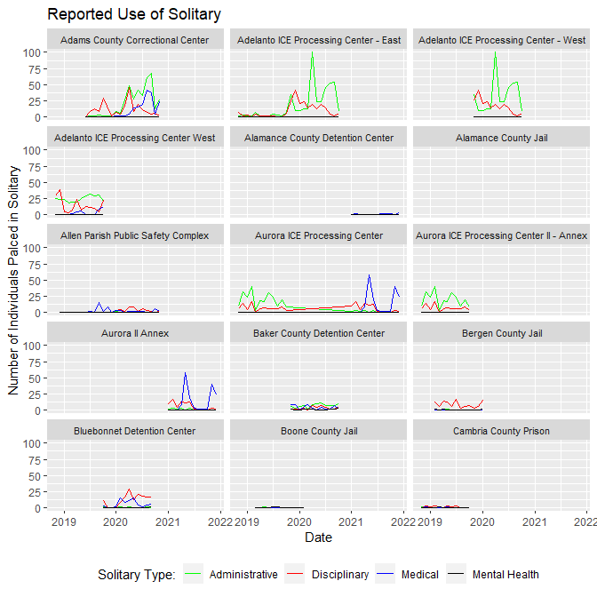

Preliminary Graphing and Reading of Inspection Data
================
Nathan Craig
5/25/2021

This document is a preliminary proof of concept to illustrate:

-   the kinds of analysis possible with the tabulation of ICE inspection
    data
-   code for reading the spreadsheet
-   specific wrangling methods unique to the data structure
-   preliminary exploratory plot of select variables from the
    Significant Incident Summary Sheets.

# Method for Reading G-324A-19-inc form

The code in @ref(appendix) is specific to data logged in G-324A-19
incident summaries. However, this is probably the most complex data
structure in the project but also the largest volume of quantitative
information. Therefore, it seemed like a good place to start with an
initial proof of concept.

There were initial issues reading in the Google Sheet. Several of the
numeric columns read into R as lists which was undesirable. In the
Google Sheet, Craig set the columns to `plain text` rather than `auto`
and the data read in fine as character columns. This seemed to resolve
the issue, and it was possible to use the `type_convert()` function from
the `reader` library to convert these columns to numbers.

There were also some issues using `lubridate` to wrangle the month and
year fields to a proper date. Craig was not able to discern the cause of
the issue. However, changing the month format on the incident sheet from
abbreviated to fully written out months solved the issue. Those changes
were made in the master Google Sheet and the data were called using the
`googlesheets4` library.

# Facet Graph of Solitary

Four columns of solitary type are pivoted longer and plotted by date.
Graphing was done using the `ggplot2` library with the `facet_wrap`
function to provide a means to compare multiple facilities
simultaneously. Such a plot can help identify trends and guide more
specific questions.

<!-- -->

# Appendix: Code used for this report

``` r
knitr::opts_chunk$set(
    echo = FALSE,
    message = FALSE,
    warning = FALSE
)
# Load necessary libraries
library(googlesheets4)
library(readr)
library(tidyverse)
library(janitor)
library(lubridate)
# Read Google Sheet, convert to data frame, and wrangle
df <- read_sheet("https://docs.google.com/spreadsheets/d/1im5VSi3bIEi13O8WQ56wEIXSyNEstbGMylXXgD9bAG0/edit#gid=1858227071",
                 sheet="G-324A-19-inc") %>% 
  clean_names() %>% 

    # Clean up the facility names separating out inspection date and state
  # Note the use of a double escape character. This was necessary.
  separate(.,
           col = facility,
           into = c("facility","inspection_date"),
           sep = "\\) - ") %>%
  separate(.,
           col = facility,
           into = c("facility","state"),
           sep = "\\(") %>% 

    # Convert the character type cols to numbers
  type_convert() %>% 
  unite(date, year:month) %>% 
  mutate(facility = as.factor(facility),
         state = as.factor(state),
         date = ym(date)
         )
# Graph specific wrangling, pivoting several cols longer
df %>% 
  pivot_longer(.,
               cols= detainees_placed_in_administrative_segregation:detainees_placed_in_segregation_for_mental_health_reasons,names_to = "segregation_type", values_to = "segregation_count") %>% 
  select(facility, date, segregation_type, segregation_count) %>% 

# Calling the plot and formatting
  ggplot(aes(x=date, y = segregation_count))+
  geom_line(aes(color = segregation_type)) +
  labs(title = "Reported Use of Solitary")+
  ylab("Number of Individuals Palced in Solitary")+
  xlab("Date")+
  theme(
    strip.text = element_text(size = 8),
    legend.position = "bottom"
    )+
    scale_color_manual(
      values = c("green",
                 "red",
                 "blue",
                 "black"),
      name = "Solitary Type:",
      labels = c(
        "Administrative",
        "Disciplinary",
        "Medical",
        "Mental Health")
      )+
    facet_wrap(~ facility, ncol=3)
```
