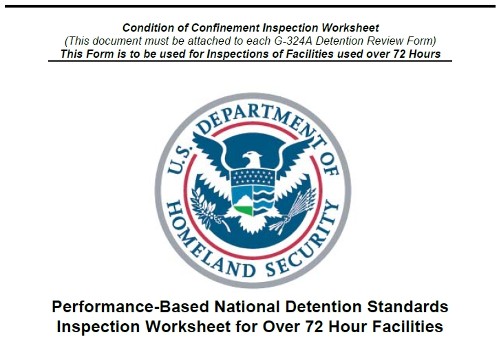
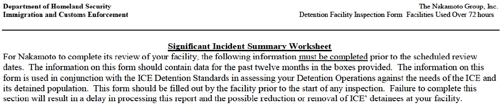
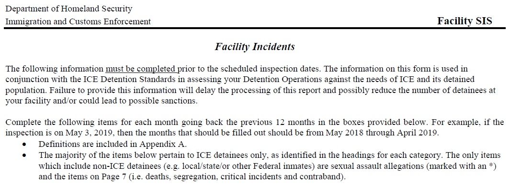

# Introduction

```{r setup, include=FALSE}
knitr::opts_chunk$set(echo = FALSE)
options(scipen=999)

library(tidyverse)
library(kableExtra)
library(ggplot2)

source("scripts/load_data_all.R")
load("data/data.RData")
```

```{css echo=FALSE}
.infobox {
  padding: 1em 1em 1em 4em;
  margin-bottom: 10px;
  border: 2px solid maroon;
  border-radius: 10px;
  background: mistyrose;
}
```

::: {.infobox}
## NOTICE {.infobox}

This document is a work in progress **under development**. Until this notice is removed, information in this document is subject to change as the underlying code is modified and refined.

Last update: *`r format(Sys.time(), "%A %B %d, %Y at %I:%M:%S %p")`*
:::

```{r, echo= FALSE, out.width= "60%", out.extra='style="float:right; padding:10px"'}

```

This project involves collating, cleaning, performing preliminary analysis of, and supplying to the public inspections related data released by Immigration and Customs Enforcement (ICE). ICE oversees a sprawling network of more than 200 immigration detention facilities. The agency is required to inspect each of these facilities at least annually according to one of several sets of detention standards. In 2018, Congressional appropriations stipulated that "ICE is directed to make public all final detention facility inspection reports within 60 days of inspection" [@departme2017, 33]. Following this, ICE began releasing pre-prepared Significant Incident Summary (SIS) forms and inspection letters. These documents do not comply with the Congressional mandate. As of July, 2021 ICE is not complying with this standing directive from Congress (see \@ref(note-regarding-inspections)). Our aim was to assemble in one place what information ICE does release, process and provide those data using reproducible methods [@yu2020; @implemen2014], and offer some insights regarding what was found.

## What We Found

Summary numbers reported here are limited to ICE detention facility inspections that use the most current SIS form. These are all inspections between `r format(inspect_earliest, format= "%B %e, %Y")` and `r format(inspect_latest, format= "%B %e, %Y")`. This sample entails `r inspect_proc_n` SIS forms at `r facility_n` facilities. Within this sample of `r inspect_proc_n` inspections, `r pass_perc`% (n=`r pass`) received a rating of either "Meets Standards" or "Acceptable."

The ICE G-324A Significant Incident Summary is organized around the following categories of information: Assaults, Disciplinary, Solitary, Use of Force, Sexual Abuse and Assault, Medical, Cause of Death.

### Assaults

-   There were `r assault_sum` assaults
-   The five facilities with the most number of assaults were: Krome Service Processing Center (n=470), Adelanto ICE Processing Center West (n=390), Prairieland Detention Center (n=330), South Texas ICE Processing Center (n=312), and Adelanto ICE Processing Center East (n=264)

### Disciplinary

-   Facilities logged `r disciplinary_sum` disciplinary infractions, of these `r disciplinary_guilty_perc`% (n=`r disciplinary_guilty_sum`) were found guilty.
-   Of the disciplinary infractions `r disciplinary_appeal` were appealed and `r disciplinary_in_favor_detained_sum` were found in favor of the detained person.
-   `r disciplinary_60_days` individuals experienced disciplinary sanctions over 60 days; this indicates prolonged solitary.
-   The five facilities with the most number of disciplinary entries were: Eloy Detention Center (n=7128), La Palma (n=6954), Krome Service Processing Center (n=4888), Sherburne County Jail (n=4070), and Immigration Centers of America - Farmville (n=3808).

### Solitary

-   There were `r segregation_sum` recorded instances of solitary confinement.
-   Administrative solitary comprised, `r segregation_admin_perc`% (n=`r segregation_admin_sum`) of the cases.
-   Disciplinary solitary made up `r segregation_disciplinary_perc`% (n=`r segregation_disciplinary_sum`) of the cases.
-   Solitary confinement for mental health reasons made up `r segregation_mental_health_perc`% (n=`r segregation_mental_health_sum`) of the cases.

### Use of Force

-   There were `r use_force_sum` use of force incidents.
-   Strip searches constituted `r use_force_strip_search_perc`% (n=`r use_force_strip_search_sum`) of the use of force incidents.
-   There were `r use_force_chemical_agents_sum` use of force incidents involving chemical agents, making up `r use_force_chemical_agents_perc` of the use of force incidents.
-   There is reason to believe that use of force incidents are significantly under reported (Section \@ref(under-reporting-use-of-force-incidents)).

### Sexual Abuse and Assault

-   748 sexual abuse allegations, \>500 detained person on detained person, 189 staff or contractor on detained person

-   102 allegations substantiated, \>90 detained person on detained person, 6 staff or contractor on detained persons

### Medical Observation

-   \>25,000 individuals under medical observation, \>4500 for mental health
-   9666 instances of infectious diseases confirmed
-   \>56,000 outside medical referrals, \>9300 for emergency care, \>580 for mental health reasons
-   \>240 suicide attempts, \>5100 individuals placed on suicide watch.
-   \>1300 hunger strikes

## Note Regarding Inspections

In 2018, ICE established a "[Facilities Inspection](https://www.ice.gov/detain/facility-inspections)" web page and began releasing documents back to May of that year.[^index-1] The website states that "ICE is posting all facility inspection reports submitted by the third-party contractor. The reports are posted below in chronological order within 60 days of inspection." For each "inspection report" ICE supplies two documents:

[^index-1]: The look of the page was modified under the Biden administration but the contents are functionally identical to the page created under the Trump administration.

-   a G-324A form known as a Significant Incident Summary (SIS) and,
-   a cover letter by the inspections contractor The Nakamoto Group.[^index-2]

[^index-2]: The SIS form G-324 is generally 4-9 pages depending on the version. On the new longer forms, one page is always nearly completely redacted, and two pages are boilerplate definitions. Therefore, both forms contain fewer than 5 pages of information.

There are two major versions of the G324A form, one revised in 2007/2008 (Figure \@ref(fig:pre2019-sis)) and another revised in 2019 (Figure \@ref(fig:post2019-sis)). Both versions of the G-324A form state that "the following information [must be completed]{.ul} prior to the scheduled review dates" (underline in original) and that "[t]his form should be filled out by the facility prior to the start of any inspection."

```{r pre2019-sis, out.width = "100%", fig.cap="Pre-2019 Form G 324-A SIS showing instructions."}

```

```{r post2019-sis, out.width = "100%", fig.cap="Post-2019 Form G 324-A SIS showing instructions."}

```

Congress directed ICE to release "all final detention facility reports." ICE claims to post "all facility inspection reports," but instead *ICE is posting SIS forms that must be filled out before inspectors even arrive at the facility*. Full facility inspection reports regularly run in excess of 150 pages. There are examples of complete inspections obtained by National Immigrant Justice Center ([NIJC](https://immigrantjustice.org/research-items/report-lives-peril-how-ineffective-inspections-make-ice-complicit-detention-center)) through FOIA [@nijc2015]. Outside of those earlier FOIA requests, which required lengthy litigation by the NIJC to force compliance, ICE has released no full inspection reports and is not complying with an unambiguous Congressional mandate to do so.

Though not in compliance, the SIS and cover letter forms do provide some information to the public. Unfortunately, data are siloed in individual pdf documents. To make matters worse, as of February 2021, under the Biden administration, ICE changed its protocol and began releasing un OCR'd bit-mapped versions of the SIS forms. Previously, these forms were released as full text pdfs. The decision by ICE to do this to SIS forms makes it that much harder to use the data that are released.[^index-3] *This project seeks to retrieve data from these documents, clean and organize that information into a usable form, and supply it along with some preliminary analysis to the public.*

[^index-3]: Under ICE Acting Director Tae Johnson, DHS Secretary Alejandro Mayorkas, and ultimately President Joe Biden.

## How the work was done

During the Summer of 2021, data from the SIS and inspection cover letters was compiled into a series of spreadsheets; this work is still in progress. Nathan Craig developed the idea for a project to collate and organize information in SIS and inspection cover letters to examine them for trends, patterns, and anomalies. The work was performed by three students funded under a National Science Foundation grant awarded to Dr. Neil Harvey (NMSU) and Dr. Jeremy Slack (NMSU). The students who performed the work were Juan Becerra (Stanford), Avigail Turima Romo (Columbia), and Daniela Navarro Verdugo (CSSLO). The three students and Dr. Craig developed a workflow for compiling individual SIS and inspection cover letters into a series of spreadsheets. These web pages, still in development, document those procedures, and provide some initial summary. Much of the analysis is done in R [@R-base] relying on the `tidyverse` [@R-tidyverse] with ggplot2 [@R-ggplot2].

```{r package-references-1}
knitr::write_bib(file = 'packages.bib')
```
